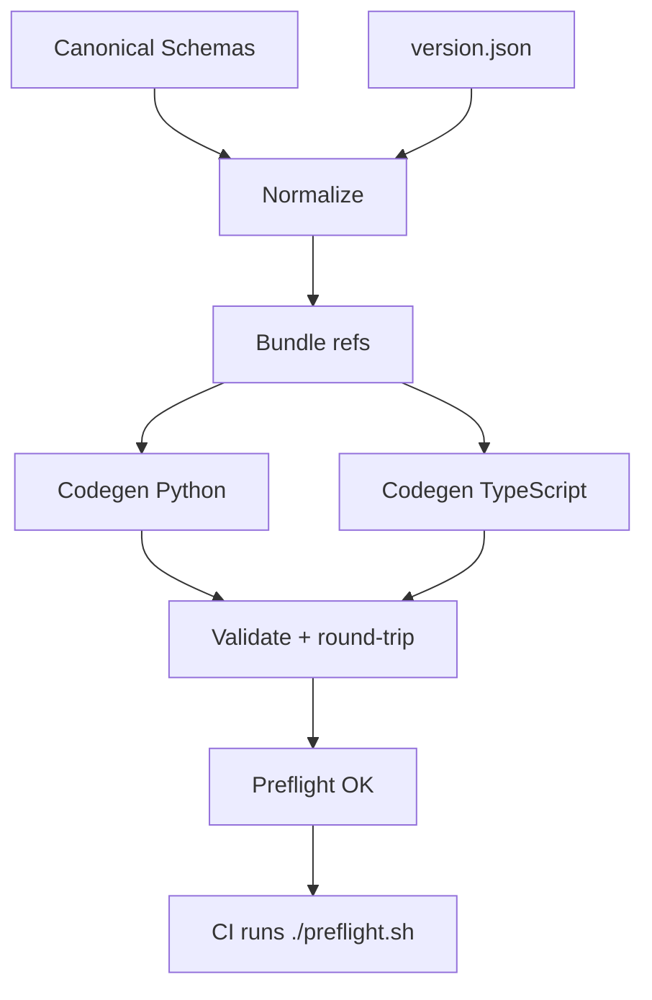
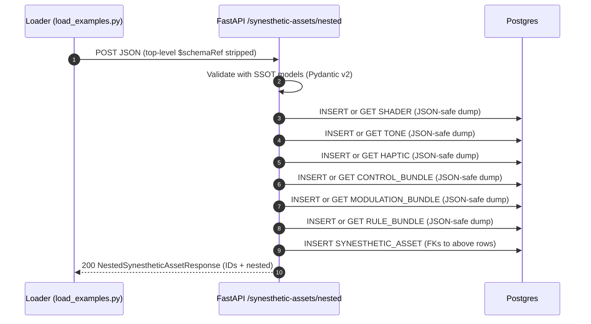

# Synesthetic Schemas

Single Source of Truth (SSOT) for Synesthetic asset and component schemas.

This repo provides canonical JSON Schemas, deterministic code generation for Python/TypeScript, and a reproducible development environment via Nix that matches CI.

---

## Install Nix (First Time Only)

If you do not have Nix installed, run the following command. If you already have Nix, you can skip to the next step.

```bash
# Install the Nix package manager (multi-user installation)
sh <(curl -L https://nixos.org/nix/install) --daemon
```

After installation, you may need to restart your shell.

## ✅ Development Workflow

This project uses [Nix](https://nixos.org/) to provide a reproducible environment.

### 1. First-Time Setup (Run Once)

After cloning the repository, follow these steps to set up the environment.

```bash
# Step 1: Enter the Nix development shell.
# This provides the correct, pinned versions of Python 3.11, Poetry, and Node.js.
nix develop

# Step 2: Install project dependencies.
# This creates a local .venv/ for Python and a node_modules/ for TypeScript.
poetry install
npm install
```

### 2. Daily Workflow

After the initial setup, you will only need these commands for day-to-day development.

```bash
# To generate all code artifacts from the schemas and run validations:
./build.sh

# To run the fast, read-only pre-commit checks that match CI:
./preflight.sh
```

---

## 🛠️ Troubleshooting: Resetting the Environment

If you ever encounter a persistent or strange environment issue, you can perform a hard reset to return to a clean slate. This is a safe operation that deletes temporary build artifacts and dependencies.

1. **Exit all shells:** Make sure you are at your normal system prompt (not inside a `nix develop` shell or a `.venv`).

   ```bash
   exit
   ```

2. **Clean the project directory:** Run this command from the repo root.

   ```bash
   rm -rf .venv/ node_modules/ flake.lock poetry.toml .cache/ meta/output/ python/src/synesthetic_schemas/ typescript/src/ typescript/tmp/
   ```

3. **Restart the workflow:** After cleaning, simply follow the **First-Time Setup** steps again.

---

## One-Time Nix Installation

If this is your first time using Nix, you'll need a brief setup.

1. **Install Nix:** Follow the instructions at [nixos.org/download.html](https://nixos.org/download.html).
2. **Enable Nix Flakes:** Add the following line to your Nix configuration file (`~/.config/nix/nix.conf` or `/etc/nix/nix.conf`):

   ```
   experimental-features = nix-command flakes
   ```

---

## Purpose

Canonical JSON Schemas for:

* `synesthetic-asset`
* `shader`
* `tone`
* `haptic`
* `control`
* `modulation`
* `rule-bundle`

Schemas are normalized and versioned here, then used to generate:

* Backend Pydantic v2 models (Python)
* Frontend `.d.ts` types (TypeScript)
* Validation of real examples with round-trip checks

---

## Layout

```
jsonschema/         # Canonical JSON Schemas (normalized, versioned)
examples/           # Example assets; each carries a $schemaRef
python/             # Generated Python models (Pydantic v2)
typescript/         # Generated TypeScript .d.ts
scripts/            # Normalization, validation, lint, bump-version helpers
codegen/            # Codegen entry points and bundler
Makefile            # One-liner tasks and preflight
preflight.sh        # Runs the exact CI checks locally (read-only)
version.json        # Single source of schema version (e.g., 0.7.0)
```

---

## Pipeline



Both local `./preflight.sh` and CI execute this exact pipeline to eliminate "works on my machine" drift.

---

## Example Architecture

The schemas are designed to be consumed by backend services that store and manage synesthetic assets. The following diagrams illustrate a typical persistence and API model.

### Entity-Relationship Diagram

This ERD shows how the different schema components can be stored as normalized entities in a relational database like PostgreSQL, with the core data stored in `JSONB` columns.

```mermaid
erDiagram
  SYNESTHETIC_ASSET {
    int      synesthetic_asset_id PK
    text     name
    text     description
    jsonb    meta_info
    int      shader_id FK
    int      tone_id FK
    int      haptic_id FK
    int      control_id FK
    int      modulation_id FK
    int      rule_bundle_id FK
    timestamptz created_at
    timestamptz updated_at
  }

  SHADER {
    int      shader_id PK
    text     name
    text     description
    jsonb    meta_info
    text     vertex_shader
    text     fragment_shader
    jsonb    uniforms          // UniformDef[]
    int      shader_lib_id FK? // optional
    timestamptz created_at
    timestamptz updated_at
  }

  SHADER_LIB {
    int      shader_lib_id PK
    text     name
    text     description
    jsonb    helpers           // Helper[]
    timestamptz created_at
    timestamptz updated_at
  }

  TONE {
    int      tone_id PK
    text     name
    text     description
    jsonb    meta_info
    jsonb    synth             // ToneSynth (+ options)
    jsonb    parts             // TonePart[]
    jsonb    parameters        // ToneParameter[]
    timestamptz created_at
    timestamptz updated_at
  }

  HAPTIC {
    int      haptic_id PK
    text     name
    text     description
    jsonb    meta_info
    jsonb    device_config     // DeviceConfig
    jsonb    parameters        // HapticParameter[]
    timestamptz created_at
    timestamptz updated_at
  }

  CONTROL_BUNDLE {
    int      control_id PK
    text     name
    text     description
    jsonb    meta_info
    jsonb    control_parameters // { key: Control[] } grouped by control_type
    timestamptz created_at
    timestamptz updated_at
  }

  MODULATION_BUNDLE {
    int      modulation_id PK
    text     name
    text     description
    jsonb    meta_info
    jsonb    modulations       // ModulationItem[]
    timestamptz created_at
    timestamptz updated_at
  }

  RULE_BUNDLE {
    int      rule_bundle_id PK
    text     name
    text     description
    jsonb    meta_info
    jsonb    rules             // Rule[]
    timestamptz created_at
    timestamptz updated_at
  }

  PROTOBUF_ASSET {
    int      protobuf_asset_id PK
    int      synesthetic_asset_id FK
    bytea    blob              // or text if base64
    jsonb    metadata
    timestamptz created_at
    timestamptz updated_at
  }

  // Relationships
  SYNESTHETIC_ASSET ||--o| SHADER           : "shader_id"
  SYNESTHETIC_ASSET ||--o| TONE             : "tone_id"
  SYNESTHETIC_ASSET ||--o| HAPTIC           : "haptic_id"
  SYNESTHETIC_ASSET ||--o| CONTROL_BUNDLE   : "control_id"
  SYNESTHETIC_ASSET ||--o| MODULATION_BUNDLE: "modulation_id"
  SYNESTHETIC_ASSET ||--o| RULE_BUNDLE      : "rule_bundle_id"
  SHADER        }o--|| SHADER_LIB           : "optional helper source"
  PROTOBUF_ASSET }o--|| SYNESTHETIC_ASSET   : "generated from"
```

### API Sequence Diagram

This sequence shows a typical "upsert" flow where a nested `SynestheticAsset` is posted to an API. The backend validates the payload, normalizes the sub-components (shader, tone, etc.), persists them individually, and then creates the top-level asset with foreign keys to the components.



---

## Versioning (Single Source)

* `version.json` holds the canonical schema version.
* Normalization uses this version to set `$id`, `x-schema-version`, and to rewrite absolute `$ref`s.
* Bump the version and normalize:

```bash
make bump-version VERSION=0.7.3
# then regenerate and validate
make codegen-py codegen-ts validate
```

---

## Preflight (CI Parity)

* Read-only checks that must pass before merging:

```bash
./preflight.sh
```

Runs: `normalize-check` → `schema-lint` → `codegen-check` → `validate`.

* Convenience (auto-fix normalization drift locally):

```bash
make preflight-fix   # writes normalized schemas, then runs preflight
```

On success, preflight stamps `.cache/last_preflight.txt` with the UTC timestamp.

* Selective skip (useful when only docs changed):

```bash
SKIP_CODEGEN_CHECK=1 ./preflight.sh
```

* CI notes: The GitHub Actions workflow installs via Poetry and uses a paths filter to only run `codegen-check` when schemas/codegen or tooling inputs change.

---

## Make Targets

* `normalize`: rewrite schemas to canonical form using `version.json`.
* `normalize-check`: fail if any file differs from normalized form (read-only).
* `schema-lint`: check duplicate `$id` and shallow `$ref` resolvability.
* `codegen-py`: generate Python Pydantic models from bundled schemas.
* `codegen-ts`: generate TypeScript `.d.ts` using repo-local tooling.
* `codegen-check`: fail if generated code differs from what’s committed.
* `validate`: validate examples with `$schemaRef` and round-trip via Pydantic.
* `preflight`: run the full read-only gate (CI parity).
* `preflight-fix`: write normalization first, then run `preflight`.
* `bump-version VERSION=X.Y.Z`: update `version.json` and normalize.
* `audit`: generate deterministic repo audit at `meta/SSOT_AUDIT.md`.

---

## Status

* ✅ Canonical schemas normalized and versioned
* ✅ Deterministic Python/TypeScript codegen
* ✅ Examples validate and round-trip clean via `$schemaRef`
* ✅ Preflight matches CI and fails fast on drift

---

## Open GitHub Issues

Draft issues live in `meta/issues/*.md`. To create them with GitHub CLI:

```bash
./scripts/create_issues.sh          # create
DRY_RUN=1 ./scripts/create_issues.sh # preview only
```