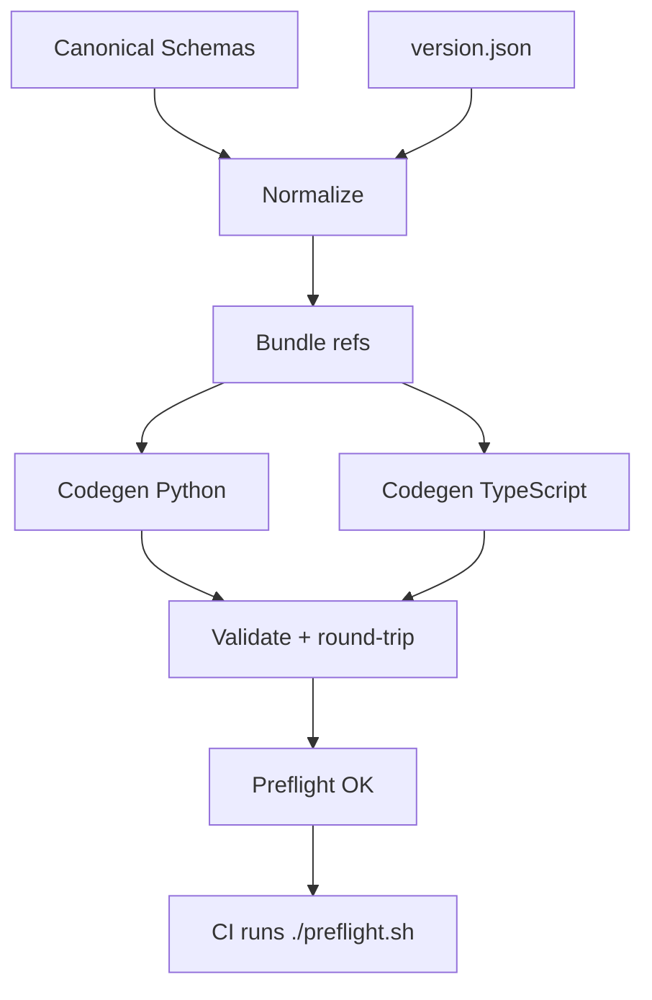

# Synesthetic Schemas

Single Source of Truth (SSOT) for Synesthetic asset and component schemas.

This repo provides canonical JSON Schemas, deterministic code generation for Python/TypeScript, and a no-“works-on-my-machine” preflight that matches CI.

---

## Purpose

Canonical JSON Schemas for:

- `synesthetic-asset`
- `shader`
- `tone`
- `haptic`
- `control`
- `modulation`
- `rule-bundle`

Schemas are normalized and versioned here, then used to generate:

- Backend Pydantic v2 models (Python)
- Frontend `.d.ts` types (TypeScript)
- Validation of real examples with round-trip checks

---

## IDs vs Canonical Schema

- Canonical schemas do not include database IDs (`*_id`). They describe portable asset documents only.
- APIs may wrap canonical assets with an envelope that adds `id`. This `id` is part of the API contract, not the canonical schema.
- Clients validate/build assets from canonical schemas and handle IDs only at API boundaries.

---

## Layout

```
jsonschema/         # Canonical JSON Schemas (normalized, versioned)
examples/           # Example assets; each carries a $schemaRef
python/             # Generated Python models (Pydantic v2)
typescript/         # Generated TypeScript .d.ts
scripts/            # Normalization, validation, lint, bump-version helpers
codegen/            # Codegen entry points and bundler
Makefile            # One-liner tasks and preflight
preflight.sh        # Runs the exact CI checks locally (read-only)
version.json        # Single source of schema version (e.g., 0.7.0)
```

---

## Pipeline



Both local `./preflight.sh` and CI execute this exact pipeline to eliminate "works on my machine" drift.

---

## Environment Setup

- Python 3.11 (conda env recommended):
  - `conda create -n schemas311 python=3.11`
  - `conda activate schemas311`
  - Install Poetry and dev tools in this env
- Node 20+ dev deps:
  - `npm ci` (at repo root)

The Makefile auto-detects and prefers `conda run -n schemas311 poetry run python`, falling back to Poetry or system Python as needed.

---

## Versioning (Single Source)

- `version.json` holds the canonical schema version.
- Normalization uses this version to set `$id`, `x-schema-version`, and to rewrite absolute `$ref`s.
- Bump the version and normalize:

```bash
make bump-version VERSION=0.7.1
# then regenerate and validate
make codegen-py codegen-ts validate
```

---

## Preflight (CI Parity)

- Read-only checks that must pass before merging:

```bash
./preflight.sh
```

Runs: `normalize-check` → `schema-lint` → `codegen-check` → `validate`.

- Convenience (auto-fix normalization drift locally):

```bash
make preflight-fix   # writes normalized schemas, then runs preflight
```

On success, preflight stamps `.cache/last_preflight.txt` with the UTC timestamp.

---

## Make Targets

- `normalize`: rewrite schemas to canonical form using `version.json`.
- `normalize-check`: fail if any file differs from normalized form (read-only).
- `schema-lint`: check duplicate `$id` and shallow `$ref` resolvability.
- `codegen-py`: generate Python Pydantic models from bundled schemas.
- `codegen-ts`: generate TypeScript `.d.ts` using repo-local tooling.
- `codegen-check`: fail if generated code differs from what’s committed.
- `validate`: validate examples with `$schemaRef` and round-trip via Pydantic.
- `preflight`: run the full read-only gate (CI parity).
- `preflight-fix`: write normalization first, then run `preflight`.
- `bump-version VERSION=X.Y.Z`: update `version.json` and normalize.

---

## Validation & Examples

- Each example JSON includes a top-level `$schemaRef` pointing to its schema (e.g., `jsonschema/synesthetic-asset.schema.json`).
- The validator prefers `$schemaRef`; in strict mode it is required.
- Transport-only metadata keys starting with `$` are ignored during validation.

CLI:

```bash
PYTHONPATH=python/src \
python scripts/validate_examples.py --strict --dir examples
python scripts/validate_examples.py --file examples/SynestheticAsset_Example1.json
```

---

## Codegen

- Python: `codegen/gen_py.sh` via datamodel-code-generator (Pydantic v2, deterministic output).
- TypeScript: `codegen/gen_ts.sh` uses repo-local `json-schema-to-typescript` (no `npx`), after bundling refs locally.

Generated code must be committed; `codegen-check` ensures the repo is in sync.

---

## Status

- ✅ Canonical schemas normalized and versioned
- ✅ Deterministic Python/TypeScript codegen
- ✅ Examples validate and round-trip clean via `$schemaRef`
- ✅ Preflight matches CI and fails fast on drift

---

## Open GitHub Issues

Draft issues live in `meta/issues/*.md`. To create them with GitHub CLI:

```bash
./scripts/create_issues.sh          # create
DRY_RUN=1 ./scripts/create_issues.sh # preview only
```
