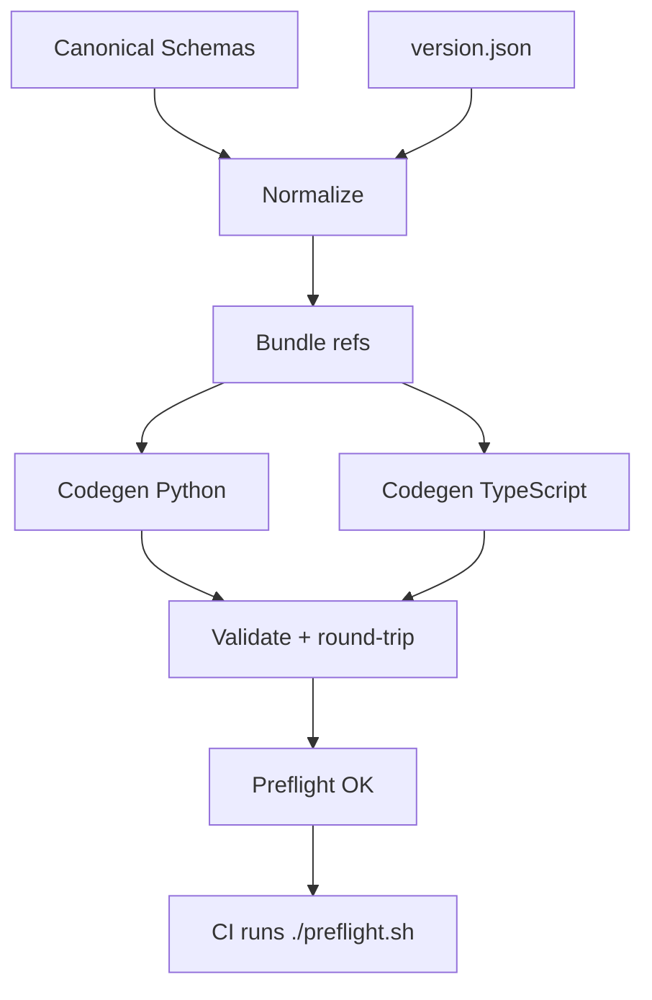

# 🔍 Schema Audit Status

| Checkpoint | Status | Detail |
|-------------|---------|--------|
| **Corpus Commit** | ✅ | `733eb265c6666aade5ee26a1f05a45253947c307` |
| **Declared Version** | ✅ | `0.7.3` (`version.json`) |
| **$id Alignment** | ✅ | All `$id` values reference `https://delk73.github.io/synesthetic-schemas/schema/0.7.3/...` |
| **Hash Fingerprint** | ✅ | `00eeb4f5551354a09df6eccac1263c21bb67ae6b375f47d692a1e9e9111c98c5` |
| **Baseline Scope** | ✅ | `docs/schema/0.7.3/*.schema.json` |
| **Audit Date** | 🕓 | 2025-10-12 |
| **Next Review** | ⏳ | when `LABS_SCHEMA_VERSION` or MCP schema changes |

**Summary:**  
Schema corpus `0.7.3` verified against [docs/governance.md](docs/governance.md).  
All `$id` and `$ref` values canonical; no drift detected.  
MCP verification pending.

---

# Synesthetic Schemas

Single Source of Truth (SSOT) for Synesthetic asset and component schemas.

This repository provides canonical JSON Schemas, deterministic code generation for Python/TypeScript, and a reproducible Nix environment that matches CI.

📘 See [docs/governance.md](docs/governance.md) for publication and versioning rules.

---

## 🌐 Vision

Synesthetic is the **core substrate** for a multimodal, schema-first *perception-layer OS*.

- **Schemas as foundation:** Every visual, audio, haptic, and control element is defined here as canonical JSON Schema.
- **Cross-modal alignment:** Enables deterministic synchronization across modalities — shaders, tones, haptics, controls.
- **Topological grounding:** Parallels [cell-sdf-topology](https://github.com/delk73/cell-sdf-topology), applying field-based operators to perception assets.
- **Embodied AI alignment:** Serves as the structural substrate for multimodal and physically grounded reasoning systems.

📚 For conceptual documentation, see [docs/README.md](docs/README.md).

---

## ✅ Development Workflow

This project uses [Nix](https://nixos.org/) for reproducible builds.

### 1. First-Time Setup

```bash
nix develop
poetry install
npm install
```

### 2. Daily Workflow

```bash
./build.sh       # normalize + generate artifacts
./preflight.sh   # fast, read-only CI parity check
```

Optional reset:

```bash
rm -rf .cache/ meta/output/
```

---

## 🛠️ Troubleshooting (Hard Reset)

```bash
exit
rm -rf .venv/ node_modules/ flake.lock poetry.toml .cache/ meta/output/ \
       python/src/synesthetic_schemas/ typescript/src/ typescript/tmp/
```

Then repeat **First-Time Setup**.

---

## Purpose

Canonical JSON Schemas for:

* `synesthetic-asset`
* `shader`
* `tone`
* `haptic`
* `control`
* `modulation`
* `rule-bundle`

Used to generate:

* Pydantic v2 models (Python)
* TypeScript `.d.ts` types
* Round-trip validation of real examples

---

## Layout

```
docs/schema/        # Canonical, versioned schemas (published via GitHub Pages)
examples/           # Example assets; each includes a $schemaRef
python/             # Generated Python models (Pydantic v2)
typescript/         # Generated TypeScript types
scripts/            # Normalization, validation, version bump helpers
codegen/            # Codegen entry points
Makefile            # One-liner tasks
preflight.sh        # CI parity checks
version.json        # Single source of schema version (e.g. 0.7.3)
```

---

## 🧩 Audit Prompt Order

All audit prompts live in `meta/prompts/` and must run **in sequence**.

| Step | Prompt                  | Purpose                                                    | Output                                  |
| ---- | ----------------------- | ---------------------------------------------------------- | --------------------------------------- |
| 1️⃣  | `eval.schema.json`      | Snapshot schema field structure (no validation).           | `meta/output/schema_eval_latest.*`      |
| 2️⃣  | `audit.schema.json`     | Compare snapshot vs spec (find missing/divergent fields).  | `meta/output/schema_audit_latest.*`     |
| 3️⃣  | `audit.docs.json`       | Validate documentation completeness and version alignment. | `meta/output/docs_state.md`             |
| 4️⃣  | `audit.governance.json` | Enforce compliance with governance.md.                     | `meta/output/governance_audit_latest.*` |

Run deterministically:

```bash
python -m codex audit --prompt meta/prompts/eval.schema.json
python -m codex audit --prompt meta/prompts/audit.schema.json
python -m codex audit --prompt meta/prompts/audit.docs.json
python -m codex audit --prompt meta/prompts/audit.governance.json
```

Each stage must produce non-empty outputs before continuing.

---

## Pipeline



---

## Versioning (Single Source)

* `version.json` defines the live schema version.
* `$id` and `$ref` are rewritten to:

  ```
  https://delk73.github.io/synesthetic-schemas/schema/0.7.3/{filename}
  ```
* Bump and rebuild:

```bash
make bump-version VERSION=0.7.3 && make publish-schemas
```

---

## Preflight (CI Parity)

```bash
./preflight.sh           # read-only checks
make preflight-fix        # auto-normalize + verify
SKIP_CODEGEN_CHECK=1 ./preflight.sh  # docs-only skip
```

---

## Make Targets

* `normalize`, `normalize-check`
* `schema-lint`
* `codegen-py`, `codegen-ts`
* `codegen-check`
* `validate`
* `preflight`, `preflight-fix`
* `bump-version VERSION=X.Y.Z`
* `publish-schemas`
* `audit` — writes deterministic report at `meta/SSOT_AUDIT.md`

---

## Status

* ✅ Canonical schemas normalized and versioned
* ✅ Deterministic code generation (Python + TypeScript)
* ✅ Examples validate and round-trip
* ✅ CI preflight parity

---

📘 **Governance Spec:** [docs/governance.md](docs/governance.md)

```

---

This version:
- Fixes `$id` host → `delk73.github.io/synesthetic-schemas/schema/0.7.3`
- Reflects `docs/schema/` instead of `jsonschema/`
- Adds the full **Audit Prompt Order**
- Pins governance version and review date  
- Removes redundant Nix install duplication for clarity  
- Keeps content deterministic, terse, and 0.7.3-aligned.