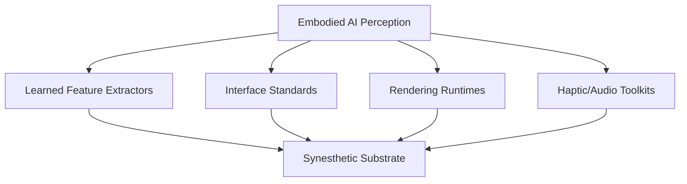

# Cross-Walk: Synesthetic and Embodied AI Interfaces

---

## Topology Overview (Draft)

## Purpose  
This document establishes a **broad crosswalk** between the Synesthetic system and the current state of the art in embodied AI perception and interfaces.  
It is not a final positioning statement, but a **map** that will be refined through Labs output and research.  

---

## Scope  
- **Unit of Analysis**: Synesthetic as a **schema-first deterministic substrate** for multimodal perception (shader, tone, haptic, control, modulation).  
- **Comparative Targets**: Embodied AI perception pipelines, XR interface standards, low-latency rendering runtimes, and haptic/audio toolkits.  
- **Exclusions**: End-to-end large language/world models; pure application-layer products.  

---

## Broad Alignment  

- **Perception Substrate**  
  - *SOTA*: Learned feature extractors, perceptual tokenization (AToken, V-JEPA).  
  - *Synesthetic*: Deterministic, schema-bound components (shader, tone, haptic) with rule-bundle orchestration.  
  - Related concept: [Tokenized Manifold](tokenized_manifold.md).  

- **Interface Layer**  
  - *SOTA*: XR APIs (OpenXR, WebGPU), haptic SDKs, game engine UIs.  
  - *Synesthetic*: Declarative UI + schema-driven controls with bidirectional sync.  

- **Runtime Footprint**  
  - *SOTA*: GPU/TPU-heavy learned models; cloud-first pipelines.  
  - *Synesthetic*: Procedural low-latency substrate targeting FPGA/Jetson-class devices — and proven real-time on **12-year-old i5 Inspiron laptops with Intel integrated graphics**, without dropped frames.  

- **Cross-Modal Coupling**  
  - *SOTA*: Mostly single-modality or loosely coupled.  
  - *Synesthetic*: Schema-unified multimodal coupling (visual/audio/haptic).  

---

## Differentiators (Draft)  
- **Determinism**: Procedural rendering + schema guarantees.  
- **Auditability**: SSOT schemas + versioned patches.  
- **Footprint**: Real-time, low-latency, minimal compute (validated on modest laptops).  
- **Flexibility**: Configurable through rule-bundles, not retrained weights.  
- Related positioning: [Positioning Synesthetic in the Embodied AI Landscape](positioning_embodied.md).  

---

## Next Steps  
- **Labs Mining**: Surface emergent paradigms from Labs outputs (shader/tone/haptic archetypes).  
- **Refinement**: Map mined paradigms against this crosswalk to adjust units and comparisons.  
- **Corpus**: Build comparative table with 15–30 SOTA references.  
- **Positioning**: Derive clear statements situating Synesthetic within embodied AI interfaces.  

---
