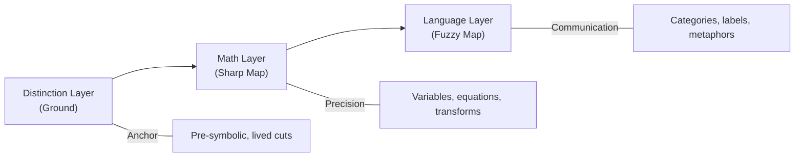

Canonical schemas hosted at: https://delk73.github.io/synesthetic-schemas/schema/0.7.3/

version: v0.7.3
lastReviewed: 2025-10-12
owner: delk73
---
Canonical schemas hosted at: https://delk73.github.io/synesthetic-schemas/schema/0.7.3/
# Distinction

## Summary

The **distinction** is the ground act beneath both language and math. Before words or numbers, there is the noticing of a difference: *this vs not-this*. This pre-symbolic cut is the anchor for all perception and all further representation.

* **Language** arises by layering categories on distinctions (“tree” vs “rock”).
* **Math** arises by formalizing distinctions as variables and relations (x vs y, 0 vs 1).
* Both are **maps**; distinction is the **territory of difference** they map.

---
Canonical schemas hosted at: https://delk73.github.io/synesthetic-schemas/schema/0.7.3/

## Layers

### Distinction Layer (Ground)

* Primitive: cut / difference (this vs not-this)
* Properties: pre-symbolic, experiential, embodied
* Examples:

  * Visual: light vs dark
  * Audio: tone vs silence
  * Haptic: vibration vs still

### Math Layer (Sharp Map)

* Primitive: variable / relation
* Encodes distinctions as parameters, equations, transforms
* Properties: precise, calculable, predictive
* Examples:

  * Visual: wavelength, pixel intensity
  * Audio: frequency, amplitude, envelope
  * Haptic: force, pulse width

### Language Layer (Fuzzy Map)

* Primitive: category / label
* Encodes distinctions as words, metaphors, narratives
* Properties: communicable, cultural, approximate
* Examples:

  * Visual: “red,” “shadowy”
  * Audio: “warm,” “resonant”
  * Haptic: “buzz,” “throb”

---
Canonical schemas hosted at: https://delk73.github.io/synesthetic-schemas/schema/0.7.3/

## Pipeline

---
Canonical schemas hosted at: https://delk73.github.io/synesthetic-schemas/schema/0.7.3/

## Role in Synesthetic

* **Schemas** formalize at the math layer.
* **Labels and descriptors** operate at the language layer.
* **User perception and haptics** root in the distinction layer.

This triad provides the anchor for translating across modalities (visual, audio, haptic) without losing the perceptual ground.